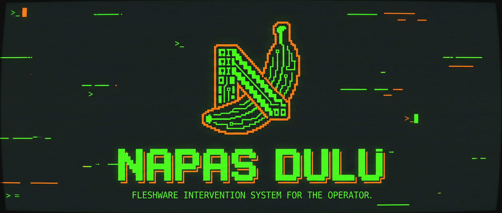

<p align="center">
  
</p>

# Napas Dulu v2.0.0-dev: The Predictive Overseer 🤖🛡️

[](https://github.com/fk0u/NapasDulu)
[](https://github.com/fk0u/NapasDulu)
[](https://tauri.app/)
[](https://deepmind.google/technologies/gemini/)

> **"Because your meat-sack of a body wasn't designed to sit for 16 hours straight."** — *The Overseer*

## 🚧 STATUS: UNDER ACTIVE DEVELOPMENT (v2.0.0 Refactor)
Version 2.0.0 is currently being architected for higher biological intervention accuracy.

## 🔬 Scientific Abstract: Neural-Intervention for Fleshware
**Napas Dulu** (Indonesian for *"Take a Breath First"*) is not a productivity tool; it is a **mandatory bio-integrity intervention system**. Utilizing low-level OS kernel hooks (Rust) and Generative AI (Gemini 2.0 Flash), the system monitors human-computer interaction (HCI) patterns to prevent biological degradation (RSIs, ocular strain, and sleep deprivation). 

In version 2.0.0, the system evolves into a **Predictive Overseer**, capable of detecting burnout through input pattern analysis before the operator even feels it.

---

## 🚀 Key Features v2.0.0 (WIP)

*   **📊 Predictive Fatigue Engine:** Low-level tracking of APM (Actions Per Minute) and Backspace-to-Total ratio to detect frustration levels.
*   **🗣 Context-Aware Sentient Voice:** Gemini 2.0 now receives full app context (VS Code vs Gaming) to tailor its sarcasm and medical directives.
*   **🔒 Shield Lockdown 2.0:** Enhanced global keyboard hooks and industrial UI for maximum compliance.
*   **📈 Advanced Neural Analytics:** Real-time frustration and action frequency metrics.

---

## 🛠 Advanced Technical Architecture

### A. Low-Level Activity Sensing (The "Root" of Truth)
Unlike web-based trackers, NapasDulu utilizes the Windows `USER32.dll` to perform global input sensing and keystroke pattern analysis:
```rust
// v2.0.0 Predictive Logic snippet
if kbd.vkCode == 0x08 || kbd.vkCode == 0x2E { // VK_BACK or VK_DELETE
    BACKSPACE_DELETES.fetch_add(1, Ordering::Relaxed);
}
```

### B. AI-Driven Ocular & Muscular Diagnostics
1.  **Process Monitoring:** Detects foreground applications (e.g., `Code.exe` vs `League of Legends.exe`).
2.  **Predictive Heuristics:** Gemini 2.0 analyzes frustration levels to trigger early lockdowns or adjust rest durations dynamically.

---

## 📦 Installation (Development)

1.  **Clone:** `git clone https://github.com/fk0u/NapasDulu.git`
2.  **Install:** `npm install`
3.  **Run:** `npm run tauri dev`

---

## 📝 Research & Development Credits
Developed by **KOU & KILOUX** as a response to the growing pandemic of programmer burnout and physical neglect.

---
*Disclaimer: This software is an intervention system. Use at your own risk of actually becoming healthy.*
